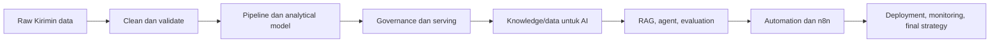

# Course Coherence & Teaching Guide

Dokumen ini adalah kontrak pedagogis untuk seluruh bootcamp. `materi.md`, notebook, assignment, capstone, dan final project harus dibaca sebagai satu perjalanan membangun solusi untuk PT Kirimin Digital Nusantara, bukan sebagai 46 tutorial yang berdiri sendiri.

## Tujuan akhir bootcamp

Setelah menyelesaikan seluruh bootcamp, peserta mampu menerima masalah operasional yang masih kabur, memetakan data dan stakeholder, merancang data infrastructure, membangun sistem AI atau automation yang terukur, men-deploy solusi dengan aman, lalu menjelaskan trade-off kepada stakeholder non-teknis.

## Cara setiap sesi diajarkan

Setiap part memakai urutan berikut:

1. **Situasi bisnis:** stakeholder Kirimin menyampaikan masalah dan batasan.
2. **Prasyarat:** peserta menghubungkan part ini dengan output part sebelumnya.
3. **Konsep formal:** definisi, asumsi, trade-off, dan vocabulary industri.
4. **Intuisi:** analogi dan contoh kecil agar konsep dapat dibayangkan.
5. **Walkthrough:** instruktur menyelesaikan kasus kecil langkah demi langkah.
6. **Validasi:** peserta memeriksa hasil, failure case, dan quality signal.
7. **Latihan terbimbing:** peserta mengubah satu bagian dengan TODO yang terarah.
8. **Assignment bridge:** peserta memahami apa yang harus dibangun sendiri dan mengapa.
9. **Handoff:** output part diberi nama dan menjadi input part berikutnya.

Jika sebuah materi hanya berisi definisi tanpa walkthrough, contoh input/output, atau hubungan ke assignment, materi tersebut belum memenuhi standar bootcamp.

## Benang merah artefak

## Fase 1 — Data Infrastructure

| Part | Fokus pembelajaran | Kasus Kirimin | Output yang dibawa |
|---|---|---|---|
| 1.1 | query dan grain | backlog order per kota | query tervalidasi |
| 1.2 | fungsi transformasi | parser batch order | fungsi + quality report |
| 1.3 | CTE/window/SLA | latest shipment | query advanced |
| 1.4 | raw-to-curated | alias, duplicate, outlier | curated + quarantine |
| 1.5 | orchestration | pipeline harian | pipeline contract |
| 1.6 | architecture | OLTP versus analytical | ADR/schema |
| 1.7 | BI metrics | delivery success rate | metric contract |
| 1.8 | quality/governance | critical order fields | quality specification |
| 1.9 | governance roadmap | RACI/maturity | roadmap 30/60/90 |
| 1.10 | reliability | pipeline terlambat | SLO/runbook |
| 1.11 | cloud | storage + serving DB | cloud decision |
| 1.12 | container | quality summary API | image/API contract |
| 1.13 | IaC | environment parity | module/CI plan |
| 1.14 | NoSQL model | tracking events | storage decision |
| 1.15 | MongoDB | latest tracking status | schema/index/query |
| 1.16 | capacity/cost | 80k event/hari | capacity model |

Capstone 1 menggabungkan semua output ini. Peserta tidak boleh langsung membuat dashboard sebelum memiliki grain, quality report, dan metric contract.

## Fase 2 — AI Engineering (LLM)

| Part | Fokus pembelajaran | Kasus Kirimin | Output yang dibawa |
|---|---|---|---|
| 2.1 | model mental LLM | FAQ support | behavior baseline |
| 2.2 | prompt engineering | jawaban SOP | prompt version + cases |
| 2.3 | AI data layer | SOP ber-versi | document manifest |
| 2.4 | RAG | jawaban dengan citation | RAG chain |
| 2.5 | reliability | provider outage | reliability wrapper |
| 2.6 | structured RAG | tiket urgent terbuka | safe query boundary |
| 2.7 | optimization | recall/latency | benchmark |
| 2.8 | presentation | citation/handoff | response schema |
| 2.9 | agent | tool selection | agent loop |
| 2.10 | fine-tuning decision | intent/style gap | experiment plan |
| 2.11 | serving | 100 support agents | serving design |
| 2.12 | cost/latency | routing/cache | cost model |
| 2.13 | evaluation | groundedness/abstain | eval plan |
| 2.14 | risk/governance | refund/PII | risk register |
| 2.15 | troubleshooting | SOP stale/tool misuse | AI runbook |

Capstone 2 hanya berhasil jika peserta menunjukkan happy path dan failure path, bukan hanya satu jawaban demo.

## Fase 3 — Automation

| Part | Fokus pembelajaran | Kasus Kirimin | Output yang dibawa |
|---|---|---|---|
| 3.1 | automation fit | notification versus refund | fit matrix |
| 3.2 | n8n fundamentals | webhook shipment | workflow dasar |
| 3.3 | data/logic | batch event | data contract |
| 3.4 | MCP capability | tracking read tool | capability registry |
| 3.5 | reliability | courier duplicate | reliability policy |
| 3.6 | trigger design | real-time versus nightly | trigger matrix |
| 3.7 | integration | ledger-to-notification | integration flow |
| 3.8 | deployment/cost | cloud versus VPS | deployment ADR |
| 3.9 | self-hosting | n8n + PostgreSQL | setup/runbook |
| 3.10 | observability | notification accepted | SLO/dashboard |
| 3.11 | AI boundary | ticket classification | bounded AI flow |
| 3.12 | incident response | duplicate side effect | incident runbook |
| 3.13 | process mapping | as-is/to-be shipment | acceptance criteria |
| 3.14 | solution fit | n8n versus custom | ADR/MVP plan |
| 3.15 | readiness | courier API differences | go/no-go scorecard |

Capstone 3 menguji apakah workflow tetap aman ketika event duplicate, provider timeout, dan tool berisiko muncul.

## Kontrak antara materi, notebook, dan assessment

- `materi.md` menjelaskan alasan, konsep, dan cara berpikir.
- `notebook.ipynb` menunjukkan satu jalur implementasi yang runnable.
- `assignment.md` meminta peserta menggeneralisasi jalur tersebut ke kasus baru.
- `solution/` memperlihatkan keputusan, failure mode, dan kesalahan umum; bukan sekadar jawaban akhir.
- Capstone mengintegrasikan output beberapa part dan mewajibkan deployment/operasi.
- Final project menguji kemampuan memilih masalah, bukan mengulang tutorial.
