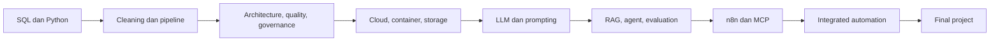

# Learning Path AI Engineer Bootcamp

## Cara membaca roadmap

Bootcamp bergerak dari data menuju AI lalu automation. Setiap part menghasilkan artefak kecil yang menjadi fondasi part berikutnya. Waktu di bawah adalah estimasi belajar mandiri dan dapat disesuaikan mentor.

| Fase | Fokus | Output | Estimasi |
|---|---|---|---|
| 1 | Data Infrastructure | pipeline, data quality, governance | 6–8 minggu |
| 2 | AI Engineering (LLM) | chatbot, integrated AI system, agent | 6–8 minggu |
| 3 | Automation | workflow n8n dengan atau tanpa AI | 5–7 minggu |
| Capstone | Integrasi per fase | code, live deployment, laporan, presentasi | 1–2 minggu per capstone |
| Final Project | Solusi lintas fase | plan, arsitektur, development strategy, deployment, presentasi | 2–4 minggu |

## Dependensi kemampuan

## Ritme belajar per part

1. Baca `materi.md` dan tulis ulang konsep kunci dengan bahasa sendiri.
2. Jalankan notebook dari awal sampai akhir; jika tool eksternal tidak tersedia, gunakan mode mock yang sudah disediakan.
3. Kerjakan mini-exercise sebelum membuka assignment.
4. Submit assignment dengan dataset sintetis dan catatan keputusan.
5. Review `solution/` dan masukkan kesalahan yang ditemukan ke catatan belajar.

## Prinsip deployment

Deployment hanya dilakukan dengan data sintetis dan secret melalui environment variable. Capstone dan final project wajib menyertakan URL/demo atau instruksi reproduksi yang dapat diverifikasi mentor.
