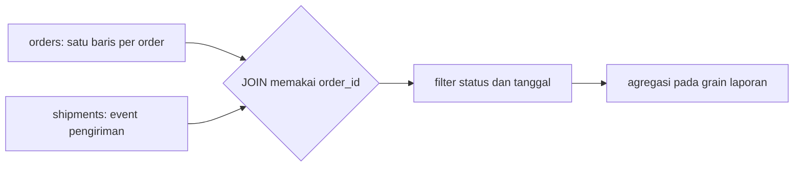

# SQL Overview

**Fase:** 1 — Data Infrastructure  
**Section:** Foundations

> Diverifikasi: PostgreSQL v18.6 — sumber: https://www.postgresql.org/docs/release/ — tanggal cek: 2026-09-18

## Tujuan belajar

Setelah menyelesaikan part ini, Anda mampu:

- menjelaskan peran tabel, baris, kolom, primary key, dan foreign key dalam model relasional;
- menulis query `SELECT` dengan filter, alias, pengurutan, dan pembatasan hasil;
- menggabungkan data order dan shipment dengan `JOIN` yang tepat;
- membuat metrik operasional memakai agregasi dan `GROUP BY`;
- membedakan `NULL` dari nilai kosong serta memeriksa hasil query dengan asumsi bisnis yang eksplisit.

## Konteks di PT Kirimin

Dinda menerima pertanyaan sederhana dari Sari: berapa banyak order yang masih belum delivered per kota, berapa nilai order yang tertunda pembayarannya, dan apakah shipment yang terlambat dapat ditelusuri kembali ke order asal. Data mentah berada pada tabel yang berbeda. SQL menjadi bahasa bersama antara engineer, analyst, dan stakeholder untuk menjawab pertanyaan tersebut secara repeatable.

## Konsep kunci

### 1. Relational model dan grain

**Definisi teknis:** Relational model merepresentasikan data sebagai relation yang secara praktis diwujudkan sebagai tabel berisi tuple/baris dan attribute/kolom. *Grain* adalah unit observasi yang diwakili oleh satu baris, misalnya satu baris pada `orders` berarti satu order, sedangkan satu baris pada `shipments` berarti satu event atau satu shipment sesuai kontrak data.

**Penjelasan sederhana:** Tabel seperti lemari arsip. Sebelum mengambil berkas, Anda harus tahu satu map mewakili apa. Jika satu map berisi satu order tetapi tabel lain berisi banyak event untuk order yang sama, menggabungkannya tanpa sadar dapat menggandakan nilai order.

Primary key mengidentifikasi satu baris secara unik. Foreign key menyatakan hubungan ke key pada tabel lain. Kontrak grain dan key harus dipahami sebelum menulis `JOIN` atau agregasi.

### 2. `SELECT`, `FROM`, dan `WHERE`

**Definisi teknis:** `SELECT` menentukan expression yang dikembalikan, `FROM` menentukan sumber relation, dan `WHERE` melakukan row-level filtering sebelum agregasi. Walaupun ditulis dengan urutan `SELECT ... FROM ... WHERE`, database memiliki logical query processing order yang berbeda, sehingga alias pada `SELECT` umumnya tidak tersedia di `WHERE` pada query yang sama.

**Penjelasan sederhana:** Anda memilih lemari (`FROM`), menyaring map yang memenuhi syarat (`WHERE`), lalu menentukan kolom yang ingin dibawa pulang (`SELECT`).

```sql
SELECT order_id, origin_city, order_value_idr
FROM orders
WHERE payment_status = 'paid'
  AND order_value_idr >= 100000
ORDER BY order_value_idr DESC
LIMIT 10;
```

### 3. `JOIN` dan kardinalitas

**Definisi teknis:** `JOIN` mengombinasikan baris dari dua relation berdasarkan predicate. `INNER JOIN` hanya mempertahankan pasangan yang cocok; `LEFT JOIN` mempertahankan semua baris dari sisi kiri dan mengisi kolom sisi kanan dengan `NULL` jika tidak ada pasangan. Kardinalitas one-to-one, one-to-many, atau many-to-many menentukan apakah hasil dapat menggandakan baris.

**Penjelasan sederhana:** `JOIN` seperti mencocokkan dua daftar menggunakan nomor referensi. Jika satu order memiliki tiga event shipment, satu order akan terlihat tiga kali setelah join. Itu benar untuk pertanyaan event, tetapi salah jika Anda menjumlahkan nilai order tanpa mengendalikan grain.

### 4. Agregasi dan `GROUP BY`

**Definisi teknis:** Fungsi agregat seperti `COUNT`, `SUM`, `AVG`, `MIN`, dan `MAX` mereduksi beberapa baris menjadi ringkasan. `GROUP BY` membagi baris berdasarkan dimensi tertentu sebelum agregasi. Setiap kolom non-agregat pada `SELECT` harus kompatibel dengan grouping.

**Penjelasan sederhana:** Dari daftar order yang panjang, Anda membuat laporan per kota. Kota adalah kelompoknya; jumlah order dan total nilai adalah ringkasannya.

```sql
SELECT origin_city, COUNT(*) AS order_count,
       SUM(order_value_idr) AS gross_value_idr
FROM orders
WHERE order_created_at >= '2026-09-01'
GROUP BY origin_city
ORDER BY order_count DESC;
```

### 5. `NULL`, missing value, dan asumsi bisnis

**Definisi teknis:** `NULL` menandakan ketiadaan atau ketidakdiketahui, bukan angka nol, string kosong, atau `FALSE`. Perbandingan terhadap `NULL` menghasilkan `UNKNOWN` dalam three-valued logic; gunakan `IS NULL`, `IS NOT NULL`, `COALESCE`, dan aturan bisnis yang eksplisit.

**Penjelasan sederhana:** Kolom `resolved_at` yang kosong tidak otomatis berarti tiket selesai pada waktu nol. Bisa jadi tiket belum selesai atau sistem belum mengirim timestamp. Anda harus menentukan arti kosong sebelum menghitung SLA.

### 6. Membaca hasil sebagai engineer

**Definisi teknis:** Query yang benar secara sintaks belum tentu benar secara semantik. Validasi harus mencakup row count, uniqueness key, null rate, rentang nilai, dan rekonsiliasi dengan angka yang diketahui. Pada production database, `EXPLAIN` membantu melihat rencana eksekusi dan potensi full table scan.

**Penjelasan sederhana:** Query adalah kalkulator. Kalkulator dapat menghitung cepat tetapi tetap menghasilkan jawaban salah jika angka masuk atau rumusnya keliru. Selalu cek beberapa baris contoh dan total sebelum menyerahkan metrik ke stakeholder.

## Pola query untuk kasus Kirimin



Untuk laporan “satu baris per order”, ringkas `shipments` lebih dahulu menjadi satu baris per `order_id`, kemudian join ke `orders`. Untuk laporan “jumlah event per status”, join langsung dapat sesuai. Keputusan ini harus tertulis dalam query atau dokumentasi.

## Tools & versi

| Tool | Versi | Penggunaan |
|---|---:|---|
| PostgreSQL | 18.6 | SQL engine yang menjadi target industri |
| Python | 3.14.7 | menjalankan notebook dan SQLite fallback |
| Jupyter | mengikuti environment peserta | menjalankan notebook interaktif |

Notebook menggunakan SQLite bawaan Python agar dapat dijalankan tanpa server database. Syntax inti sengaja kompatibel dengan PostgreSQL; perbedaan dialect harus diuji kembali pada PostgreSQL sebelum deployment.

## Referensi resmi

- [PostgreSQL SQL syntax](https://www.postgresql.org/docs/current/sql.html)
- [PostgreSQL `SELECT`](https://www.postgresql.org/docs/current/sql-select.html)
- [PostgreSQL table expressions dan joins](https://www.postgresql.org/docs/current/queries-table-expressions.html)
- [PostgreSQL aggregate functions](https://www.postgresql.org/docs/current/functions-aggregate.html)

## Ringkasan dan lanjut ke praktik

Anda sudah memiliki vocabulary untuk membaca skema dan membuat query operasional dasar. Jalankan `notebook.ipynb` untuk membuat dataset order/shipment sintetis, menulis query bertahap, dan memeriksa risiko row multiplication. Setelah itu kerjakan `assignment.md`.

## Posisi part dalam bootcamp

Part ini membuka Fase 1. Anda sedang membangun kemampuan membaca data bisnis sebelum membuat pipeline. Kontrak yang harus dibawa ke part berikutnya adalah: satu baris pada tabel mewakili apa, key apa yang unik, dan metrik apa yang ingin dihitung. Part 2 akan membungkus aturan ini dengan Python; Part 3 akan memperluasnya dengan window function dan query plan.

## Kapan konsep ini dipakai

Gunakan SQL dasar ketika stakeholder membutuhkan jawaban yang repeatable dari data relasional: backlog shipment, order berbayar, nilai transaksi, atau rekonsiliasi antar tabel. Jangan langsung memakai agregasi setelah join jika tabel detail memiliki banyak baris per order. Jika pertanyaannya meminta latest status, perubahan antar-event, atau analisis performa query, lanjutkan ke Part 3.

## Walkthrough terpandu: backlog shipment Kirimin

1. Tulis pertanyaan bisnis: “Berapa order berbayar yang belum delivered per kota pada tanggal laporan?”
2. Tetapkan grain output: satu baris per kota. Grain sumber adalah satu baris per order pada orders dan banyak event per order pada shipments.
3. Audit key lebih dahulu: hitung total order, jumlah order_id unik, dan jumlah shipment event per order_id. Jika total berbeda dengan jumlah unik, jangan menjumlahkan order value setelah join mentah.
4. Buat ringkasan latest shipment menjadi satu baris per order. Setelah itu gunakan LEFT JOIN dari orders agar order tanpa event tetap terlihat.
5. Filter payment_status = paid, kelompokkan berdasarkan kota, lalu hitung order_count dan backlog_value. Pisahkan NULL latest_status dari status yang memang bukan delivered.
6. Validasi tiga hal: total per kota sama dengan total pada level order, tidak ada kota kosong yang diam-diam hilang, dan sampel order dapat ditelusuri kembali ke sumber.
7. Catat asumsi: delivered berarti status terakhir delivered, timezone laporan Asia/Jakarta, dan order yang belum memiliki event masuk kategori missing_event.

## Latihan terbimbing

- Ubah laporan menjadi satu baris per merchant tanpa menggandakan order value.
- Cari order paid yang belum memiliki shipment event dengan LEFT JOIN.
- Bandingkan COUNT(*) dengan COUNT(DISTINCT order_id) setelah join dan jelaskan perbedaannya.
- Temukan alias kota JKT dan Jakarta, lalu tulis catatan mengapa standardisasi belum boleh dilakukan di query tanpa mapping resmi.
- Untuk setiap query, tambahkan komentar grain, key, dan aturan NULL.

## Checkpoint penguasaan

Anda siap lanjut jika dapat menjelaskan mengapa query operasional bisa benar secara sintaks tetapi salah secara grain, membuktikan tidak ada row multiplication, dan merekonsiliasi hasil agregasi dengan total order-level.

## Jembatan ke assignment

Assignment harus menghasilkan submission.sql yang berisi query bertahap, komentar grain, query audit kualitas, dan catatan asumsi. Simpan hasil contoh, bukan hanya screenshot, sehingga solution dapat membandingkan angka dan reasoning Anda.
