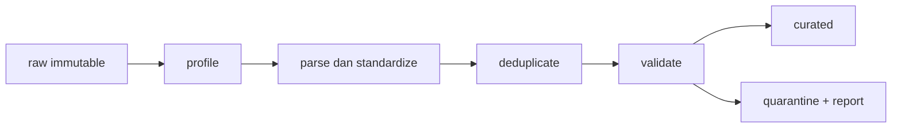

# Data Cleaning and Processing

**Fase:** 1 — Data Infrastructure  
**Section:** Foundations

> Diverifikasi: Python v3.14.7 — sumber: https://docs.python.org/3/ — tanggal cek: 2026-09-18
> Diverifikasi: pandas v3.0.3 — sumber: https://pandas.pydata.org/docs/whatsnew/v3.0.3.html — tanggal cek: 2026-09-18

## Tujuan belajar

- membuat data profile sebelum mengubah data;
- menangani missing value, duplicate, format tidak konsisten, dan outlier dengan aturan terdokumentasi;
- membedakan correction, quarantine, dan imputation;
- membuat transformasi idempotent dan dapat diaudit;
- menghasilkan output curated beserta quality report.

## Konteks di PT Kirimin

File dari partner sering memakai `DD/MM/YYYY`, sedangkan API memakai ISO timestamp. Kota ditulis sebagai `JKT` atau `jakarta`, order retry muncul dua kali, dan satu nilai order bernilai sangat besar karena salah satuan. Membersihkan data bukan berarti menghapus masalah; tugas engineer adalah membuat masalah terlihat dan keputusan dapat ditelusuri.

## Konsep kunci

### Profiling

**Definisi teknis:** Data profiling mengukur struktur dan distribusi data, termasuk null rate, unique count, range, format, dan frekuensi kategori sebelum transformasi.

**Penjelasan sederhana:** Sebelum merapikan gudang, Anda menghitung barang, menemukan label rusak, dan mencatat barang yang hilang. Tanpa inventaris awal, Anda tidak tahu apakah proses cleaning memperbaiki atau merusak.

### Deduplikasi dan idempotence

**Definisi teknis:** Deduplikasi memilih satu record representatif dari beberapa record yang dianggap sama berdasarkan business key dan ordering rule. Transformasi idempotent menghasilkan output yang sama ketika dijalankan berulang pada input yang sama.

**Penjelasan sederhana:** Menjalankan ulang batch karena retry tidak boleh menggandakan order. Proses harus mengenali bahwa order tersebut sudah pernah diproses.

### Missing value dan quarantine

**Definisi teknis:** Missing value ditangani berdasarkan makna domain: reject jika key wajib hilang, impute jika ada dasar statistik/bisnis, atau quarantine untuk review. Setiap pilihan mengubah bias data dan harus dicatat.

**Penjelasan sederhana:** Alamat kosong pada paket mungkin harus ditahan, bukan ditebak. Menebak tanpa aturan bisa mengirim paket ke kota yang salah.

### Outlier dan schema drift

**Definisi teknis:** Outlier adalah observasi yang jauh dari distribusi atau aturan domain; schema drift adalah perubahan struktur/tipe/semantik sumber dari waktu ke waktu. Keduanya tidak selalu error, sehingga perlu triage.

**Penjelasan sederhana:** Order besar bisa merupakan transaksi korporat sungguhan atau salah ketik. Anda perlu sinyal dan review, bukan menghapus semua angka besar.

## Pipeline cleaning yang disarankan

Simpan raw input, gunakan mapping table untuk standardisasi kota, simpan alasan reject, dan tambahkan `processed_at` serta `source_batch_id` untuk lineage.

## Tools & versi

| Tool | Versi | Peran |
|---|---:|---|
| Python | 3.14.7 | runtime |
| pandas | 3.0.3 | profiling dan transformasi |

## Referensi resmi

- [pandas missing data](https://pandas.pydata.org/docs/user_guide/missing_data.html)
- [pandas duplicate handling](https://pandas.pydata.org/docs/reference/api/pandas.DataFrame.drop_duplicates.html)
- [pandas datetime](https://pandas.pydata.org/docs/user_guide/timeseries.html)

## Lanjut ke praktik

Notebook menjalankan profiling dan cleaning pada dataset kecil yang kotor. Assignment meminta Anda mempertahankan quarantine dan membuat pipeline yang dapat dijalankan ulang.

## Posisi part dalam bootcamp

Part ini mengubah data mentah yang tidak rapi menjadi output curated dan quarantine yang dapat dipertanggungjawabkan. Ia menyatukan SQL grain, kontrak Python, dan aturan domain Kirimin. Setelah part ini, Anda tidak lagi mengatakan “data sudah dibersihkan” tanpa menunjukkan input profile, rule, jumlah baris yang berubah, dan alasan baris ditahan.

## Kapan konsep ini dipakai

Lakukan profiling sebelum cleaning ketika sumber berubah, partner mengirim format baru, atau angka bisnis tiba-tiba bergeser. Standardize jika variasi memang sinonim resmi. Quarantine jika informasi penting tidak cukup untuk mengambil keputusan. Impute hanya jika ada dasar domain atau statistik yang dapat dijelaskan. Jangan menghapus outlier hanya karena nilainya besar.

## Walkthrough terpandu: batch partner yang kotor

1. Simpan raw input apa adanya dengan source_batch_id dan hash file. Raw adalah bukti, bukan tempat memperbaiki data.
2. Buat profile: jumlah baris, kolom, dtype, null rate, unique key, distribusi kota, rentang nilai, dan pola timestamp.
3. Parse tanggal dengan daftar format yang diperbolehkan. Baris dengan format tidak dikenal diberi reason invalid_timestamp, bukan ditebak.
4. Standardisasi kota melalui mapping table versioned. Nilai yang tidak ada di mapping masuk quarantine dengan reason unknown_city.
5. Deduplikasi memakai business key order_id dan aturan latest ingestion_at. Simpan duplicate_count pada report dan jangan menimpa raw.
6. Validasi nilai: order_id wajib, order_value_idr tidak negatif, dan paid order memiliki payment_at. Tandai outlier sebagai review jika belum ada keputusan reject.
7. Tulis curated, quarantine, dan quality_report. Jalankan lagi dan bandingkan row count, content hash, serta alasan reject untuk menguji idempotence.

## Latihan terbimbing

- Hadapi perubahan nama kolom dari order_value menjadi order_value_idr dengan schema adapter yang eksplisit.
- Buat mapping table yang menyimpan effective_date dan owner.
- Uji input kosong, semua baris invalid, duplicate-only, dan timestamp campuran.
- Tambahkan data quality JSON yang dapat dibaca Part 5.
- Jelaskan kapan missing city boleh diimpute dan kapan harus ditahan.

## Checkpoint penguasaan

Anda siap lanjut jika dapat menelusuri setiap curated row ke raw row, menjelaskan setiap quarantine reason, dan membuktikan cleaning tidak menghapus masalah tanpa jejak.

## Jembatan ke assignment

Assignment harus menghasilkan generator minimal 1.000 baris sintetis dengan seed tetap, profile sebelum-sesudah, curated, quarantine, quality report, dan test idempotence. Sertakan alasan setiap rule dan contoh satu baris untuk setiap kategori masalah.
