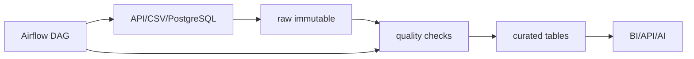

# Database and Big Data Pipeline

**Fase:** 1 — Data Infrastructure  
**Section:** Data Architecture, Pipeline & Governance

> Diverifikasi: Apache Airflow v3.3.2 — sumber: https://airflow.apache.org/docs/apache-airflow/3.3.2/ — tanggal cek: 2026-09-18
> Diverifikasi: Apache Spark v4.2.0 — sumber: https://spark.apache.org/releases/ — tanggal cek: 2026-09-18
> Diverifikasi: Docker Engine v29.6.2 — sumber: https://docs.docker.com/engine/release-notes/29/ — tanggal cek: 2026-09-18

## Tujuan belajar

- membedakan transactional database, staging, curated, dan serving layer;
- merancang batch pipeline yang idempotent dan dapat di-backfill;
- menjelaskan kapan memakai distributed processing seperti Spark;
- membuat DAG dengan dependency dan retry yang eksplisit;
- mengukur freshness, completeness, dan failure boundary pipeline.

## Konteks di PT Kirimin

Data order masuk dari aplikasi dan partner API, shipment event datang lebih sering, dan laporan harian harus tersedia sebelum pukul 07.00. Reza meminta pipeline yang dapat diulang ketika satu task gagal tanpa menggandakan data.

## Konsep kunci

### Pipeline layer

**Definisi teknis:** Pipeline memindahkan dan mentransformasi data dari source menuju target melalui tahapan yang memiliki contract, state, dan observability. Raw/staging menjaga data asal; curated menerapkan aturan kualitas; serving mengoptimalkan akses konsumen.

**Penjelasan sederhana:** Data melewati stasiun penerimaan, sortir, quality check, lalu rak display. Setiap stasiun punya tanggung jawab berbeda.

### Batch, streaming, dan watermark

**Definisi teknis:** Batch memproses kumpulan data pada interval; streaming memproses event berkelanjutan. Event time dan watermark membantu menangani data terlambat tanpa menunggu selamanya.

**Penjelasan sederhana:** Batch seperti mengambil semua paket pada akhir hari; streaming seperti memproses paket ketika tiba. Watermark adalah batas waktu kapan Anda berhenti menunggu paket yang terlambat.

### Orchestration dan idempotence

**Definisi teknis:** Orchestrator mengatur dependency, schedule, retry, state, dan alert antar task. Task idempotent aman dijalankan ulang untuk input/partition yang sama.

**Penjelasan sederhana:** Orchestrator adalah dispatcher yang tahu urutan pekerjaan dan dapat mengirim ulang pekerjaan gagal tanpa mengirim paket dua kali.

### Distributed processing

**Definisi teknis:** Spark membagi komputasi dan data ke beberapa executor. Distribusi berguna ketika satu mesin tidak cukup, tetapi menambah biaya serialization, shuffle, dan operational complexity.

**Penjelasan sederhana:** Jika satu orang tidak cukup menyortir puluhan ribu paket, pekerjaan dibagi ke banyak meja; tetapi koordinasi antar meja juga memiliki biaya.

## Blueprint pipeline Kirimin

Gunakan `run_date` atau partition sebagai idempotency key, simpan run metadata, dan pisahkan failure yang dapat retry dari data quality failure yang harus quarantine.

## Tools & versi

| Tool | Versi | Peran |
|---|---:|---|
| Apache Airflow | 3.3.2 | orchestration |
| Apache Spark | 4.2.0 | distributed processing |
| Docker Engine | 29.6.2 | local reproducible services |
| PostgreSQL | 18.6 | relational source/target |

## Referensi resmi

- [Airflow core concepts](https://airflow.apache.org/docs/apache-airflow/stable/core-concepts/overview.html)
- [Spark SQL programming guide](https://spark.apache.org/docs/latest/sql-programming-guide.html)
- [Docker documentation](https://docs.docker.com/engine/)

## Lanjut ke praktik

Notebook mensimulasikan DAG lokal dan partitioned processing tanpa perlu menyalakan Airflow. Assignment meminta rancangan pipeline yang siap dipindahkan ke orchestrator.

## Posisi part dalam bootcamp

Part ini menggabungkan sumber relasional, proses cleaning, dan orkestrasi menjadi pipeline. Anda berpindah dari fungsi yang dapat dijalankan manual ke rangkaian task dengan dependency, retry, partition, dan state. Outputnya menjadi fondasi arsitektur analitik, governance, dan serving API pada part berikutnya.

## Kapan konsep ini dipakai

Gunakan batch untuk proses periodik yang memiliki batas waktu dan volume dapat diproses per partition. Gunakan streaming ketika keputusan harus dibuat hampir real-time. Gunakan Airflow untuk dependency, schedule, retry, dan alert; gunakan Spark ketika volume atau parallelism melebihi kemampuan satu proses, bukan sekadar karena tool tersebut populer.

## Walkthrough terpandu: daily order pipeline

1. Tetapkan partition run_date dan kontrak sumber. Satu run untuk tanggal yang sama harus aman dijalankan ulang.
2. Task ingest menulis raw immutable. Task profile membaca raw tanpa mengubahnya. Task transform menghasilkan curated dan quarantine.
3. Task quality gate menghentikan publish jika aturan severity critical gagal, tetapi tetap menyimpan report dan raw.
4. Task serving membangun tabel backlog dan shipment SLA dari curated. Gunakan replace-per-partition atau merge dengan key yang jelas.
5. Tambahkan dependency sehingga serving tidak berjalan sebelum quality gate lulus. Pisahkan retryable infrastructure failure dari non-retryable data quality failure.
6. Simulasikan kegagalan task transform, jalankan retry, lalu buktikan curated tidak mengganda. Simulasikan late-arriving event dan jelaskan backfill.
7. Ukur freshness, completeness, run duration, retry count, serta jumlah quarantine sebagai pipeline metadata.

## Latihan terbimbing

- Gambar DAG minimal enam task dan tandai input-output setiap task.
- Buat idempotency key dari pipeline_name, run_date, dan source_batch_id.
- Bandingkan proses pandas dengan Spark untuk dataset kecil dan jelaskan overhead Spark.
- Rancang backfill tujuh hari tanpa menimpa partition yang tidak berkaitan.
- Tentukan alert yang dikirim untuk missing source, quality failure, dan task timeout.

## Checkpoint penguasaan

Anda siap lanjut jika dapat menjelaskan failure boundary tiap task, menunjukkan rerun aman untuk satu partition, dan membedakan kebutuhan batch, streaming, dan distributed processing dengan alasan berbasis volume/latency.

## Jembatan ke assignment

Assignment harus memuat pipeline blueprint, DAG atau simulasi DAG, generator data, partition strategy, retry policy, quality gate, observability metrics, dan prosedur backfill. Sertakan command run lokal yang dapat diulang mentor.
